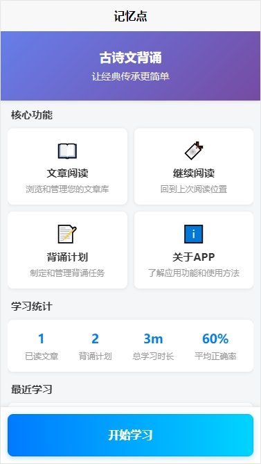
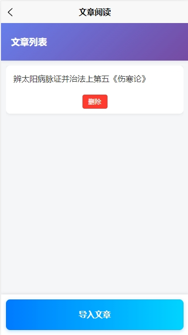
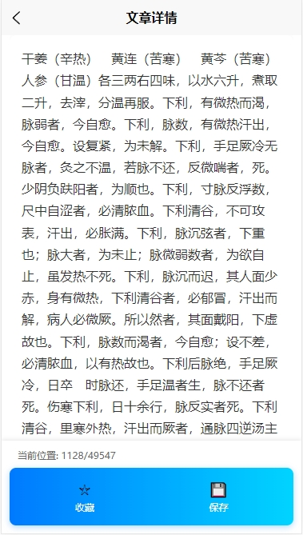
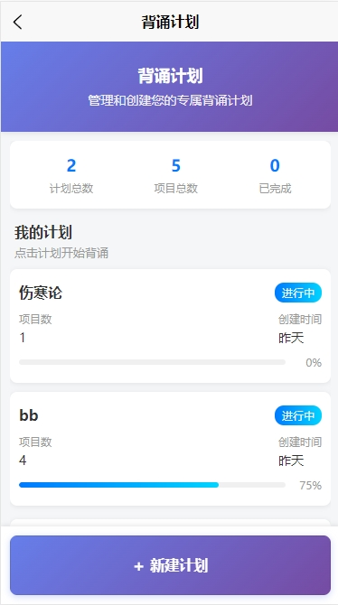
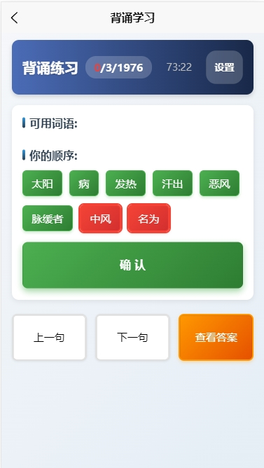
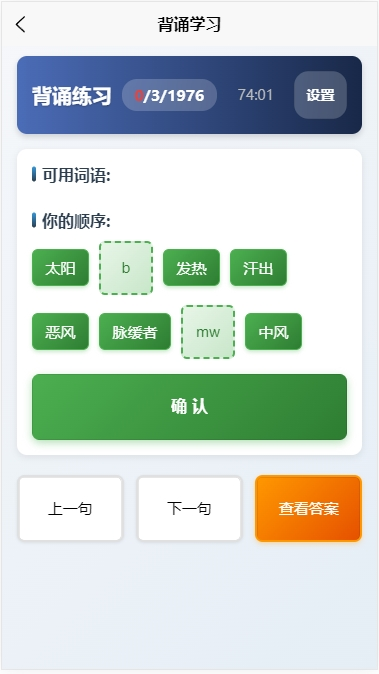

# 记忆点 APP

体验地址：https://wmlgl.github.io/jyd-project

 

一个基于uniapp的开源本地APP，专为背诵文章设计。本应用提供完整的背诵学习解决方案，支持背诵计划管理、文章阅读、背诵效果分析等功能。

## 主要功能

### 📚 文章阅读
- 从GitHub Pages读取文章数据
- 智能目录管理，支持标题过滤
- 继续阅读功能，自动记录阅读进度
- 书签功能，方便标记重要内容

### 📝 背诵计划
- 创建、编辑、删除背诵计划
- 支持添加整篇文章或特定段落
- 智能背诵方式：将段落拆分成词语或短句
- 用户通过排列组合完成背诵
- 根据难度设置隐藏部分词句，支持拼音首字母输入

### 📊 背诵效果
- 详细的学习效果统计
- 正确答案与错误答案对比
- 正确率、背诵时间等关键指标
- 基于遗忘曲线的遗忘率和记忆率估算
- 学习进度可视化展示

### ℹ️ 关于应用
- 功能介绍和使用说明
- 开源代码贡献指南
- 问题反馈渠道
- 开发者信息

## 技术栈

- **前端框架**: Vue 3 + TypeScript
- **移动端框架**: UniApp
- **构建工具**: Vite
- **样式预处理器**: Less/Sass
- **状态管理**: Vue 3 Composition API
- **AI开发**: TRAE

## 快速开始

### 环境要求
- Node.js 22+
- npm 或 yarn

### 安装依赖
```bash
npm install
```

### 开发模式
```bash
# H5开发
npm run dev:h5

# 其他平台开发请参考package.json中的脚本命令
```

### 构建发布
```bash
# H5构建
npm run build:h5
```

## 开发要求

- **代码质量**: 编写专业、可维护的代码
- **界面设计**: 提供专业、美观的用户界面
- **用户体验**: 功能简单易用，操作流畅

## 开发计划

### ✅ 已完成
- [x] 本地文章导入功能
- [x] 计划管理（创建、编辑、删除计划）
- [x] 文章书签和继续阅读进度
- [x] 背诵难度设置（隐藏部分词语让用户通过拼音首字母输入）
- [x] 拼音首字母输入支持

### 🔄 进行中/待完成
- [ ] 遗忘曲线算法实现
- [ ] 数据持久化和云同步
- [ ] UI美化和响应式设计
- [ ] 真实GitHub Pages数据源集成

## 贡献指南

欢迎提交Issue和Pull Request来改进这个项目！

## 许可证

本项目采用MIT许可证，详见LICENSE文件。

## 风格
按下面的风格重新设计页面（不是所有元素都必须，只是大方向），要专业而简便，层次分明：页面结构框架
布局结构
容器层: 全屏容器 + 内边距
内容区: 垂直堆叠的多个section
底部固定栏: 固定定位的操作按钮区域
组件模式
输入卡片: 标签+输入框+辅助信息
选择卡片: 平铺选项卡，支持选中状态
步骤流程: 数字标识的分步操作引导
内容列表: 滚动区域内的项目展示
操作按钮: 渐变背景的主要操作按钮
设计规范
圆角卡片设计 (16rpx)
阴影效果增强层次感
蓝色主色调用于选中状态
底部固定布局
响应式间距和字体大小
交互特征
卡片式选择交互
步骤引导流程
实时状态反馈
模态操作确认

## 功能展示


首页



导入文章：支持txt, html文件集合的zip压缩包



查看文章详情



背诵计划：选择文章或段落创建计划



趣味背诵：拆分句子，用户拖动或点击进行排序



趣味背诵：中级难度，方框需要用户输入拼音首字母

## ❤ 支持作者 ❤
